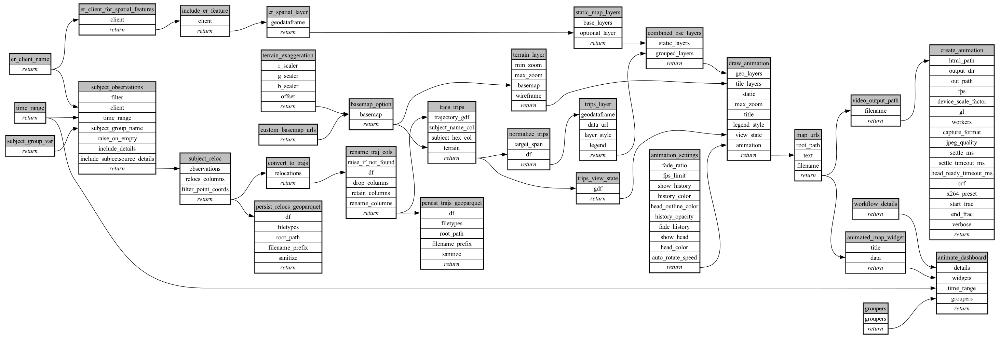

```
# AUTOGENERATED BY ECOSCOPE-WORKFLOWS; see fingerprint in README.md for details

```

```yaml
# fingerprint:
artifacts_sha256_basic: 80ae1ac35a57ae5d990dea80146738d267a724a1c9b4f7f4013217155b768d3d
artifacts_sha256_strict: f9698b4fa2f1ea9d822fd63ae3131d3cbdc68ef1bbb49f0f029058230be838b6
installed_requirements:
- channel: https://repo.prefix.dev/ecoscope-workflows/
  name: ecoscope-platform
  version: {version: ==2.15.1}
- channel: https://repo.prefix.dev/ecoscope-workflows-custom/
  name: ecoscope-workflows-ext-custom
  version: {version: ==0.1.0rc14}
- channel: https://repo.prefix.dev/ecoscope-workflows-custom/
  name: ecoscope-workflows-ext-ste
  version: {version: ==0.0.0rc1}
- channel: https://repo.prefix.dev/ecoscope-workflows-custom/
  name: ecoscope-workflows-ext-mep
  version: {version: ==1.0.4}
- channel: conda-forge
  name: pydeck
  version: {version: ==0.9.2}
- channel: conda-forge
  name: opentelemetry-sdk
  version: {version: ==1.44.0}
params_sha256: f0f434118b064616705d6e8d35f8ef37d993ca44d6b8cd9ca95ea9bcc8b3df04
spec_sha256: 4c9e1f7d35aec5eab5e0eed38d3c74950675885cca07f270fcd79898d874f048

```

# ecoscope-workflows-animate-tracks-workflow


